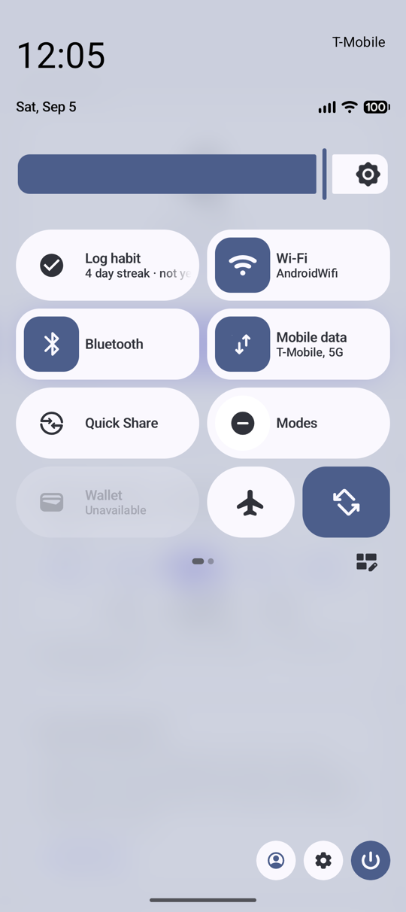
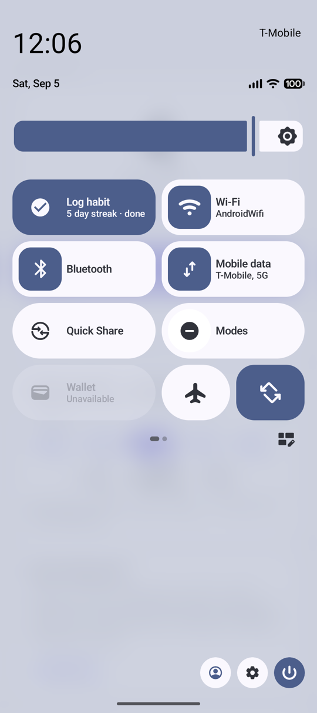
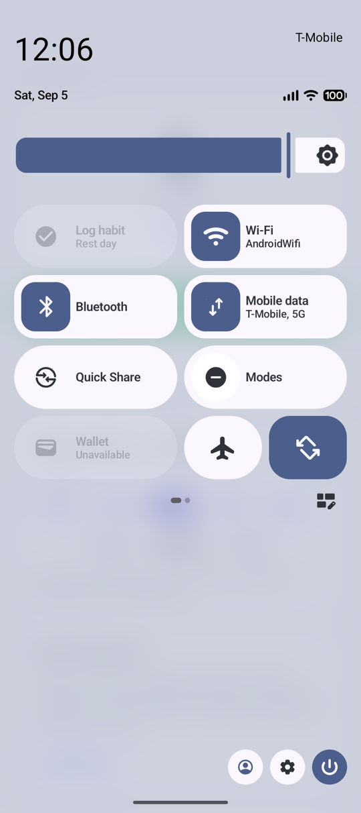
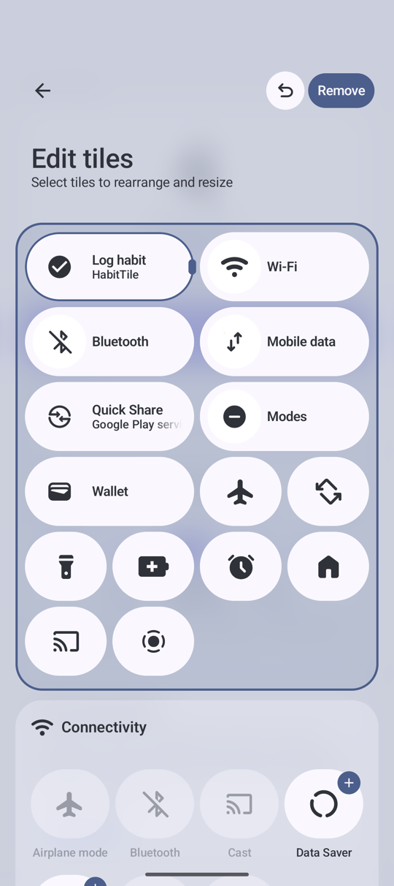
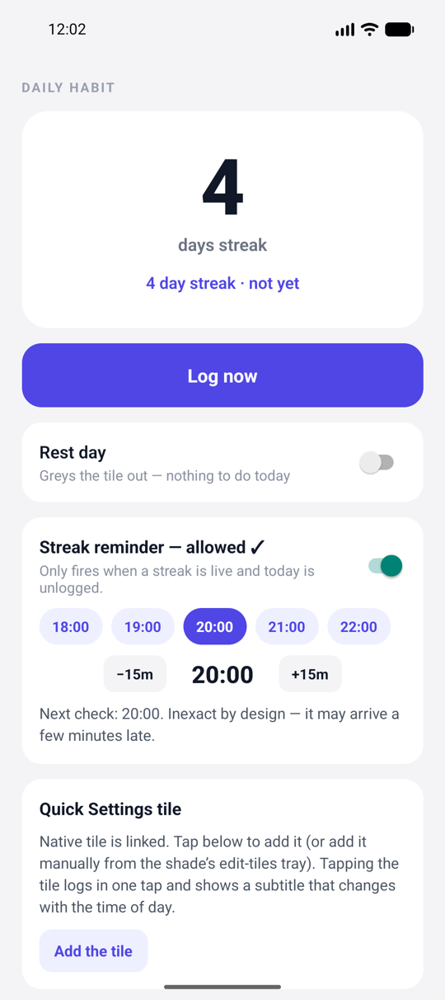
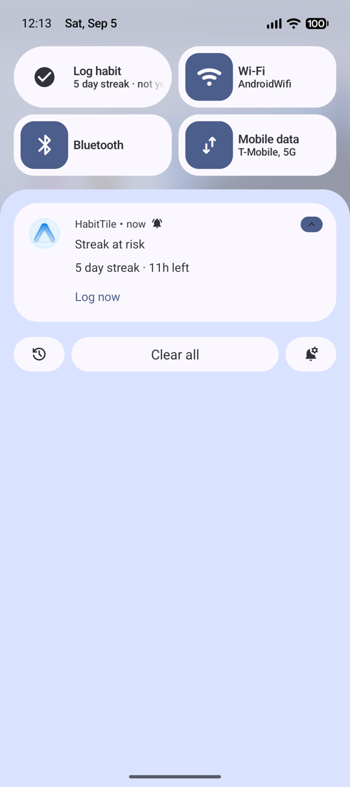
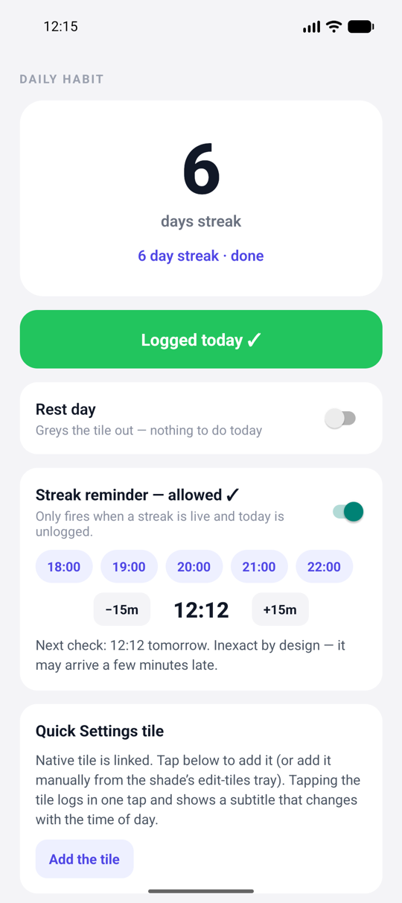
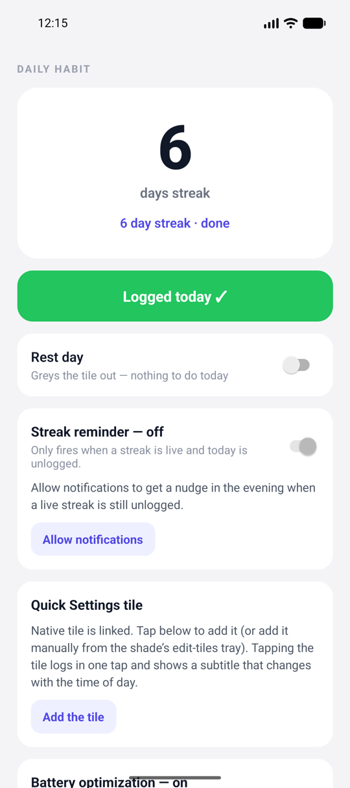

# HabitTile

Log a daily habit in one tap from the Android Quick Settings shade. The tile shows a streak that is always correct when you look at it, and an evening reminder nudges you only when a live streak is still unlogged.

Built with Expo SDK 57 and a local Kotlin native module. Android only.

## Screenshots

**The tile**

<table>
  <tr>
    <td align="center"><br><sub>Unlogged, with a subtitle that changes through the day</sub></td>
    <td align="center"><br><sub>One tap logs it</sub></td>
    <td align="center"><br><sub>Rest day greys it out</sub></td>
    <td align="center"><br><sub>In the shade's tile editor</sub></td>
  </tr>
</table>

**The app and the reminder**

<table>
  <tr>
    <td align="center"><br><sub>Streak screen</sub></td>
    <td align="center"><br><sub>Streak-at-risk reminder</sub></td>
    <td align="center"><br><sub>After "Log now" from the notification</sub></td>
    <td align="center"><br><sub>Reminder card before permission is granted</sub></td>
  </tr>
</table>

## How it works

There is no reliable "midnight" on Android. Doze, App Standby and OEM battery managers mean you cannot count on a job running at 00:00, or on your process existing at all. So this app never resets the streak on a timer. It stores the timestamp of the last log and derives the streak from it every time anyone asks.

Three surfaces share one SharedPreferences store and read the same derived value, so they can never disagree:

- **The Quick Settings tile** (`TileService`). The system instantiates it, possibly while the app process is dead. Tapping it logs the habit. Opening the shade recomputes the subtitle, so it reads "4 day streak · not yet" at lunch and "· last hour" after 11pm.
- **The app.** A streak screen, a one-tap log button, a rest-day toggle, the reminder settings, and onboarding for the two Android battery layers (AOSP Doze exemption and OEM autostart).
- **The reminder.** An inexact `AlarmManager` alarm that fires through Doze without any exact-alarm permission. The alarm is a wake-up, not a decision: the receiver reads the store at fire time and stays silent if today is already logged, it's a rest day, or there is no live streak. The notification's "Log now" action logs through the same store without opening the app, and the notification expires at local midnight.

The full design notes, including the Android background-execution playbook and adb test commands, are in [PROJECTS.md](PROJECTS.md).

## Project layout

```
App.tsx                          Single screen: streak, log, rest day, reminder, onboarding
modules/expo-habit-tile/
  index.ts                       Typed JS API with safe fallbacks before a native rebuild
  android/src/main/
    AndroidManifest.xml          Tile service, reminder receivers, permissions (manifest-merged)
    java/expo/modules/habittile/
      HabitStore.kt              The derive-on-read store (the heart of it)
      HabitTileService.kt        The tile: three states + subtitle + one-tap log
      ReminderScheduler.kt       Arm/cancel the alarm, decide at fire time, post the notification
      ReminderAlarmReceiver.kt   Alarm fired
      ReminderActionReceiver.kt  "Log now" action
      ReminderBootReceiver.kt    Re-arm after reboot, app update, time or timezone change
      ExpoHabitTileModule.kt     JS bridge, notification permission, battery/OEM escape hatches
docs/screenshots/                The images above
```

## Build and run

Requirements: Node, JDK 17, the Android SDK with an emulator or device, and the Expo CLI (installed with the project).

```bash
npm install
npx expo run:android
```

`expo run:android` generates the native project, builds the debug APK, installs it and starts Metro. The Kotlin module is autolinked from `modules/`; after changing any Kotlin file, run `npx expo run:android` again rather than relying on Fast Refresh.

## Trying it out

1. **Add the tile.** Open the Quick Settings shade, tap the edit (pencil) button and drag "Log habit" into the active area. On recent Android versions it lands as a small icon-only tile; drag its resize handle to make it large so the label and subtitle show. You can also tap "Add the tile" in the app on Android 13+.
2. **Log from the shade.** Tap the tile. It turns active and the app reflects the log the next time it comes to the foreground.
3. **Turn on the reminder.** Tap "Allow notifications" on the Streak reminder card, then pick a time. To see it fire quickly, use the ±15m steppers to set a time a few minutes ahead, press Home, and wait. It only fires when a streak is live and unlogged, so log yesterday first (or move the device date forward a day after logging).
4. **Inspect from adb** if you want to confirm what the system sees:

```bash
adb shell dumpsys alarm | grep -A3 ReminderAlarmReceiver          # the armed alarm
adb shell dumpsys notification --noredact | grep -A20 com.habittile.app
adb shell dumpsys battery unplug && adb shell dumpsys deviceidle force-idle   # simulate Doze
```

The OEM battery layer (Xiaomi, Oppo, Vivo, Transsion) cannot be reproduced on an emulator; only a physical device with that skin will tell you whether the tile and reminder survive.

## Roadmap and known gaps

- Home-screen widget with a streak grid, sharing the same store.
- The app doesn't refresh after a tile tap while it's already on screen; it updates on the next foreground.
- A rest day currently doesn't preserve the streak across the skipped day.
- One hardcoded habit; no custom name or icon yet.

## License

MIT. See [LICENSE](LICENSE).
